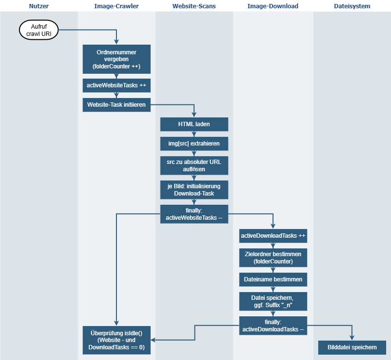

# Entwurf des Web-Crawlers

## 1. Zielsetzung und Gesamtidee

Das System durchsucht übergebene Webseiten nach Bildern und speichert diese lokal. Der Fokus liegt auf Parallelität und klarer Modularisierung.

Die Verarbeitung folgt einer zweistufigen Pipeline:

1. `WebsiteAnalyzer` verarbeitet Webseiten und extrahiert Bild-URLs.
2. `ImageDownloader` lädt diese Bild-URLs herunter und persistiert sie.

Beide Stufen arbeiten parallel, sind aber getrennt konfigurierbar. So wird verhindert, dass eine Stufe die andere unnötig ausbremst.

## 2. Architektur und Modularisierung

Die Architektur trennt Interfaces und Implementierungen, um den SOLID-Prinzipien zu folgen:

#### 2.1 API-Schicht
Die API-Schicht definiert die Interfaces. Damit bleibt die Nutzung des Crawlers stabil, auch wenn sich interne Implementierungsdetails ändern.

1. `IImageCrawler` beschreibt die Hauptschnittstelle mit `crawl(URI)` und `isIdle()`.
2. `IImageCrawlerConfig` verwaltet die Betriebsparameter (Parallelitätsgrenzen, Downloadpfad).

#### 2.2 Core-Schicht

Die Core-Schicht ist in vier Klassen aufgeteilt, die jeweils eine klar abgegrenzte Verantwortung haben:

1. `ImageCrawler`: Orchestrierung, Task-Einplanung, Zustandszusammenführung.
2. `WebsiteAnalyzer`: HTML laden, `img`-Referenzen extrahieren, URLs auflösen.
3. `ImageDownloader`: Download und Speicherung inklusive Konfliktbehandlung.
4. `ImageCrawlerConfig`: Konfiguration von Parallelität und Downloadpfad.

#### 2.3 Darstellung der Modularisierung

Die folgende Abbildung visualisiert den modularen Ablauf und die getrennten Parallelitätsbereiche (Quelle: eigene Darstellung):

## 3. Datenkanäle zwischen den Modulen

**1. Steuerkanal:** Der Aufruf von `crawl(URI)` initiiert den Prozess und übergibt die Start-URLs.
**2. Analysekanal:** `ImageCrawler` erstellt für jede URL eine Analyse-Task und startet parallele Website-Scans.
**3. Transferkanal:** `WebsiteAnalyzer` übergibt gefundene Bild-URLs als einzelne Download-Tasks an einen Thread-Pool des `ImageDownloader`. 
**4. Persistenzkanal:** `ImageDownloader` legt den Unterornder fest und speichert die Bilder lokal ab. Bei Namenskonflikten wird atomar ein neuer Name generiert.
**5. Zustandskanal:** `isIdle()` fragt den aktuellen Zustand ab, der über atomare Zähler in `ImageCrawler` getrackt wird.

## 4. Parallelisierte Bereiche
Das Programm ist in zwei parallelisierte Bereiche unterteilt:
1. Website-Scans
2. Bild-Downloads

Website-Scans sind von der Netzwerklatenz und der Komplexität der Webseiten abhängig, Downloads vor allem von der Dateigröße und den Serverantwortzeiten. Durch die Trennung in zwei Bereiche können beide unabhängig voneinander optimiert und skaliert werden. Die Parallelität der Downloads und Scans reduziert den Einfluss von langsamen Webseiten oder großen Dateien auf die Gesamtdauer.

## 5. Eingesetzte Strategy Patterns
#### 5.1 Algorithmic Strategy Patterns

1. Task Parallelism
Das Programm wird in zwei Teilaufgaben zerlegt, die parallel laufen: Website-Analyse und Bild-Download. Diese Aufgaben sind fachlich getrennt und kooperieren über klar definierte Übergabepunkte.

2. Data Parallelism
Gleiche Operationen werden auf vielen unabhängigen Datenelementen parallel ausgeführt: mehrere Start-URLs werden parallel analysiert und mehrere Bild-URLs parallel heruntergeladen.

#### 5.2 Implementation Strategy Patterns

1. Manager/Worker
`ImageCrawler` koordiniert den Programmablauf, indem es unabhängige Arbeiten auf Worker-Threads in den jeweiligen Pools verteilt. Der Manager aggregiert außerdem den Laufzustand über `isIdle()`.

2. Loop Pattern
Die Verarbeitung wiederholt dieselbe Logik für viele Elemente: URL-Liste einreihen, `img`-Referenzen iterieren und daraus Download-Tasks erzeugen.
